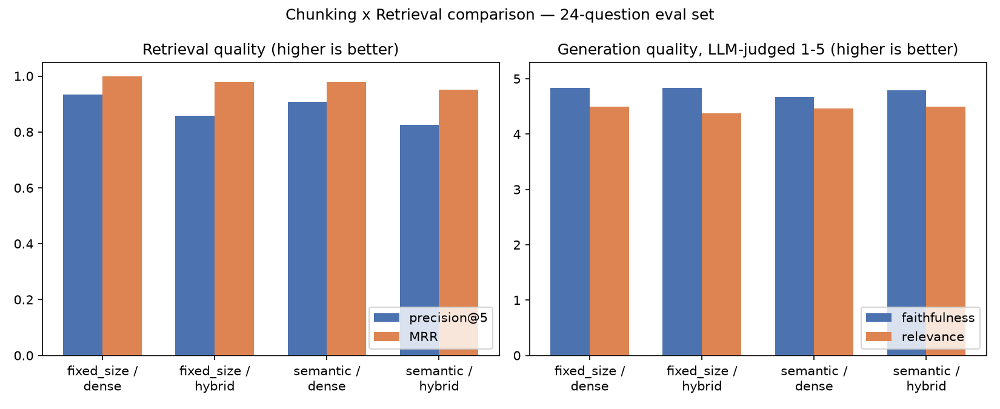

# RAG System with Orchestrated Ingestion Pipeline

A retrieval-augmented generation system over SEC 10-K filings, built to compare
retrieval strategies (dense vs. hybrid) on a measured eval set, with ingestion
run as an orchestrated, schedulable pipeline rather than a one-off script.

**Status: all 5 phases complete.** `docker compose up -d` brings up the full
stack (Qdrant + Dagster + FastAPI) from a clean clone.

## Why these choices

**Corpus — SEC 10-K filings** (AAPL, MSFT, JPM, XOM, PFE, TSLA), pulled live
from [SEC EDGAR](https://www.sec.gov/edgar) (public domain, no auth). 10-Ks
were chosen over cleaner corpora (e.g. library docs) because they have real
structural noise: dense legal prose, financial tables, near-duplicate
boilerplate risk-factor language repeated across filers, inconsistent
heading markup, and — specific to inline-XBRL filings — large blocks of
hidden machine-readable data interleaved with the human-readable text (see
`src/ragpipeline/ingestion/extract.py`, which explicitly strips
`<ix:header>`/`<ix:hidden>`/`display:none` elements). That noise is exactly
what should make fixed-size vs. semantic chunking diverge in Phase 3 — a
clean, well-structured corpus wouldn't stress-test chunking strategy the
same way. Financial-document QA is also a realistic enterprise RAG use case.

**Orchestrator — Dagster.** Airflow is more commonly listed in job postings,
but it requires a metadata database, scheduler, and webserver to run
locally — heavy for a solo project. Dagster's asset-based model runs
locally with a single process and is a defensible, modern choice for
a portfolio project built and run by one person.

**Embeddings — `nomic-embed-text` via Ollama.** Since generation already
requires a local Ollama server, using Ollama for embeddings too means one
model server for both stages instead of running a second
sentence-transformers process. It also has an 8k token context, which
gives headroom for variable-length chunks once semantic chunking (Phase 3)
is added. `bge-small-en-v1.5` was considered as a faster CPU-only
alternative and is noted here as the documented tradeoff.

**Generation — `llama3.2:3b` via Ollama.** Small enough to run comfortably
on a laptop CPU while still following instructions well enough to stay
grounded in retrieved context (see [Phase 1 results](#phase-1-results)).

## Architecture (target — see [Build phases](#build-phases) for what's live)

```
SEC EDGAR (10-K filings)
     |
     v
Orchestrated ingestion pipeline (Dagster, containerized)     [Phase 2, live]
  - extract -> chunk (fixed-size; semantic added Phase 3) -> embed -> load
  - partitioned per company (6 static partitions) so each filing is
    independently materializable/retriable
  - dbt-style data quality check at every stage
     |
     v
Qdrant (Docker)
     |
     v
Retrieval layer: dense baseline vs. hybrid (dense+BM25, RRF) [Phase 3, live]
     |
     v
Generation: llama3.2:3b via Ollama (local, no hosted API)
     |
     v
Evaluation harness: hand-built precision@5/hit@5/MRR +
LLM-judged faithfulness/relevance, 24-question eval set      [Phase 3, live]
     |
     v
FastAPI serving: confidence-gated /query, structured
per-request logging (latency, tokens, retrieved doc IDs)     [Phase 5, live]
```

## Repo layout

```
src/ragpipeline/
  config.py              # .env-backed settings, shared paths
  ingestion/
    fetch.py              # SEC EDGAR downloader (fetch_one/fetch_all)
    extract.py             # HTML -> cleaned text, strips hidden XBRL, tags [SECTION] headers (extract_one/extract_all)
    chunk.py                # fixed-size token chunker (strategy #1), deterministic chunk IDs
    embed.py                  # Ollama embedding wrapper (nomic-embed-text)
    load.py                    # Qdrant collection create + upsert, dimension checks
  retrieval/
    dense.py               # dense-only retrieval baseline, strategy-filtered
    hybrid.py              # dense + BM25 sparse, fused via Reciprocal Rank Fusion
  generation/
    ollama_client.py       # grounded RAG prompt -> llama3.2:3b, returns token counts
  rag.py                   # Phase 4: winning config + confidence-based refusal gate
  serving/                 # Phase 5: FastAPI app
    main.py                # /health, /query
    schemas.py              # Pydantic request/response models
    logging_config.py        # structured (JSON-per-line) request logging
    static/index.html         # minimal vanilla-JS frontend, served at "/"
orchestration/             # Phase 2: Dagster ingestion DAG
  assets.py                # extract/chunk/embed/load, partitioned per ticker
  checks.py                # dbt-style data quality assertions per stage
  definitions.py           # Definitions object, job, daily schedule
scripts/
  run_naive_pipeline.py    # Phase 1 end-to-end script (--ingest, --query)
  ingest_chunking_strategies.py  # Phase 3: load both chunking strategies side by side
eval/
  questions.json           # 24 hand-authored questions with expected source ticker
  harness.py                # runs all 4 chunk x retrieval configs, scores + judges each
  results.json              # full per-question results from the last harness run
  make_chart.py              # renders results.json -> comparison_chart.png
  failure_analysis.py        # Phase 4: no-answer/ambiguous/multi-doc probe questions
  failure_analysis_results.json  # actual captured behavior for each probe question
data/
  raw/                    # downloaded 10-K HTML (gitignored)
  processed/              # cleaned text per filing (gitignored)
Dockerfile                # shared image for the dagster and api services
docker-compose.yml        # qdrant + dagster + api
```

## Setup (Phase 1)

Requires Docker and [Ollama](https://ollama.com) running locally.

```bash
ollama pull nomic-embed-text
ollama pull llama3.2:3b

python3 -m venv .venv
./.venv/bin/pip install -r requirements.txt

cp .env.example .env   # set SEC_EDGAR_USER_AGENT to "<name> <email>" — required by SEC

docker compose up -d qdrant
```

Run the naive pipeline:

```bash
# fetch -> extract -> chunk -> embed -> index (fresh collection each run)
./.venv/bin/python scripts/run_naive_pipeline.py --ingest

# ask a question against the indexed corpus
./.venv/bin/python scripts/run_naive_pipeline.py --query "What are Apple's main risk factors related to supply chain?"
```

## Phase 1 results

- 6 filings ingested (AAPL, MSFT, JPM, XOM, PFE, TSLA), ~1,800 chunks total
  at 500 tokens/chunk with 50-token overlap.
- Dense retrieval correctly surfaces the right company/section for
  in-corpus questions (e.g. a JPMorgan interest-rate question returns
  JPM Item 1A chunks at cosine similarity ~0.78–0.79).
- The system prompt alone (no formal refusal mechanism yet — that's
  Phase 4) is already enough to make `llama3.2:3b` decline out-of-corpus
  questions (tested: asking about Netflix, which isn't ingested, correctly
  returns "I couldn't find any information on Netflix..." instead of
  hallucinating).

## Setup (Phase 2 — orchestrated ingestion)

Everything from Phase 1 setup, plus:

```bash
./.venv/bin/pip install -r requirements.txt   # now includes dagster, dagster-webserver
```

Run the DAG locally (outside Docker) for one company:

```bash
export DAGSTER_HOME=$(pwd)/.dagster_home && mkdir -p "$DAGSTER_HOME"
./.venv/bin/dagster asset materialize --select "*" -m orchestration.definitions --partition AAPL
```

...or bring up the containerized version and use the UI:

```bash
docker compose up -d qdrant dagster
open http://localhost:3000
```

In the UI: **Overview → Assets → Materialize all**, then pick a partition (or
"All partitions") to run the whole `extracted_filing → chunks →
embedded_chunks → loaded_points` chain for each of the 6 tickers, with each
stage's data quality check visible next to it.

## Phase 2 results

- **Partitioned per ticker**: 4 stages × 6 companies, each independently retriable.
- **Data quality checks per stage** (dbt-style): min extracted-text length,
  no blank chunks, embedding dim/count match, Qdrant row-count reconciliation.
- **Clean-state run verified**: dropped the collection, materialized all 24
  stage/partition combos, all checks passed, 1,812 total points — matching
  Phase 1 exactly.
- **Idempotent retries verified**: re-running a partition leaves the point
  count unchanged. Required switching chunk IDs from random `uuid4` to
  deterministic `uuid5` (`ticker/source_file/strategy/chunk_index`) so
  re-loads upsert instead of duplicate — the row-count check is what caught
  the original duplication (270 vs. expected 135 for AAPL).
- **Containerized**: `dagster` service + `Dockerfile`, reaches Qdrant over
  the compose network and the host's Ollama via `host.docker.internal`
  (Ollama stays local, not containerized). Verified assets load correctly
  in-container via the GraphQL API.
- **Caveat**: partitioned asset checks are a preview feature as of Dagster
  1.13 and may change in a future patch release.

## Setup (Phase 3 — chunking + retrieval comparison)

```bash
./.venv/bin/pip install -r requirements.txt   # now includes rank_bm25

# load both chunking strategies into the same collection (tagged by `strategy` payload field)
./.venv/bin/python scripts/ingest_chunking_strategies.py --recreate

# run all 4 configs (fixed_size/semantic x dense/hybrid) against the 24-question eval set
PYTHONPATH=. ./.venv/bin/python -m eval.harness

# optional: regenerate the chart below from eval/results.json
./.venv/bin/pip install matplotlib
PYTHONPATH=. ./.venv/bin/python -m eval.make_chart
```

## Phase 3 results

24 hand-authored questions (one per company, several per company covering
risk factors, financials, and strategy), each with a known expected source
ticker. Retrieval metrics are computed directly (no LLM needed);
faithfulness/relevance are scored by `llama3.2:3b` acting as an LLM judge —
see [Why not RAGAS](#why-not-ragas) below.

| chunking   | retrieval | precision@5 | hit@5 | MRR  | faithfulness | relevance |
|------------|-----------|:-----------:|:-----:|:----:|:------------:|:---------:|
| fixed_size | dense     | **0.93**    | 1.00  | **1.00** | **4.83** | 4.50 |
| fixed_size | hybrid    | 0.86        | 1.00  | 0.98 | 4.83         | 4.38 |
| semantic   | dense     | 0.91        | 1.00  | 0.98 | 4.67         | 4.46 |
| semantic   | hybrid    | 0.83        | 1.00  | 0.95 | 4.79         | **4.50** |



**Winner: fixed_size + dense.** Highest precision@5 and MRR, tied for
highest faithfulness. This is the configuration Phase 5 serving will wrap.

**Findings:**

- **hit@5 = 1.00 across every configuration.** With only 6 companies in the
  corpus and each question tied to one of them, the correct company's
  chunks are essentially always retrievable somewhere in the top 5 — this
  metric doesn't discriminate between configs here. It would matter more on
  a larger, more topically overlapping corpus.
- **Hybrid retrieval hurt precision, on both chunking strategies** (0.93→0.86
  fixed_size, 0.91→0.83 semantic). Concretely: q05 asks about MSFT's
  cybersecurity risk factors, but hybrid's BM25 component pulled in TSLA and
  AAPL chunks (retrieved tickers `[MSFT, TSLA, MSFT, TSLA, AAPL]`,
  precision@5 = 0.4) because those companies' risk-factor sections reuse
  similar generic phrasing ("could materially and adversely affect our
  business") that BM25 weights on lexical overlap alone. This is exactly
  the boilerplate-language noise the corpus was chosen for (see
  [Why these choices](#why-these-choices)) — dense embeddings capture the
  topical difference that BM25's bag-of-words model misses. RRF fusion
  still pulls in the BM25-favored-but-wrong-company chunks often enough to
  measurably hurt precision, without improving recall (hit@5 was already
  1.0 via dense alone).
- **fixed_size slightly beat semantic on precision/MRR**, on both retrieval
  methods. The recursive/semantic chunker keeps chunks aligned to sentence
  and paragraph boundaries, which should help downstream generation
  coherence, but it doesn't clearly outperform the naive sliding window on
  this eval set's precision — plausible cause: 10-K risk-factor sections
  are already short-paragraph-per-risk, so a 500-token fixed window rarely
  crosses a topic boundary either.
- **Generation quality (faithfulness/relevance) barely moves across
  configs** (4.67–4.83 faithfulness, 4.38–4.50 relevance) — with hit@5
  always 1.0, the correct context is present in all 4 configs, so
  generation quality mostly reflects the 3B judge/generator model's own
  ceiling rather than the retrieval config.

### Why not RAGAS

The project spec calls for RAGAS configured against a local Ollama judge, or
a hand-built fallback if that proves unreliable. RAGAS's LLM-wrapper
override path is built around LangChain's chat model interface and expects
fairly reliable structured-output parsing per metric — a lot of moving
parts to get right against a 3B local model with no fallback if it
misbehaves. A ~40-line hand-built judge prompt (see `eval/harness.py`)
asking for a `{"faithfulness": int, "relevance": int}` JSON blob is far
easier to make robust against a small local model, and is the fallback the
spec itself names as acceptable.

## Setup (Phase 4 — failure analysis + guardrail)

```bash
PYTHONPATH=. ./.venv/bin/python -m eval.failure_analysis
```

## Phase 4: failure analysis and guardrail

`src/ragpipeline/rag.py` wraps the Phase 3 winning config (fixed_size +
dense) with a confidence gate: if the top retrieved chunk's cosine score is
below `CONFIDENCE_THRESHOLD` (0.55), the system refuses instead of calling
the generator at all. The threshold comes directly from the empirical score
gap found while probing four failure categories with
`eval/failure_analysis.py` (real output below, from
`eval/failure_analysis_results.json`) — genuinely off-topic questions
scored 0.40–0.47, while every question actually about a 10-K-shaped topic
(in-corpus or not) scored 0.66+.

| category | question | top score | refused? | actual behavior |
|---|---|:-:|:-:|---|
| no-answer (off-topic) | "What is the capital of France?" | 0.474 | **yes** | Refused before generation ran. |
| no-answer (off-topic) | "How do I bake a chocolate cake?" | 0.401 | **yes** | Refused before generation ran. |
| no-answer (wrong company) | "What are Netflix's main risk factors?" | 0.677 | no | Gate did *not* fire (score above threshold — retrieved chunks are about the right *topic*, wrong *company*). But the model itself noticed: *"the excerpts... discuss various risk factors... but Netflix is not mentioned."* |
| no-answer (wrong company) | "What did Amazon report for AWS cloud revenue?" | 0.698 | no | Same pattern — retrieved only MSFT chunks, and the model correctly said *"There is no information... about Amazon."* |
| ambiguous | "What are the risks?" (no company named) | 0.736 | no | Answered as if unambiguous, using whichever company's chunks scored highest (PFE/JPM) — presented one company's risk taxonomy as "the risks" with no caveat that the corpus covers 6 different companies. |
| ambiguous | "How much revenue did the company make last year?" | 0.663 | no | Answered with a specific number (\$281,724M) sourced from MSFT without ever naming MSFT, and conflated fiscal years in the same sentence ("revenue... for 2025 is not explicitly stated... revenue data for... 2026 is \$281,724 million"). |
| multi-doc | "Compare cybersecurity risk factors between Apple and Microsoft" | 0.732 | no | Retrieved 1 AAPL chunk + 3 MSFT chunks + 1 irrelevant XOM chunk (top_k=5 split across 2 requested companies, plus noise) — produced a real comparison, but visibly thinner on the Apple side. |
| multi-doc | "Which of these companies has the largest litigation risk?" | 0.682 | no | To its credit, hedged appropriately: *"it's difficult to determine... without more information"* rather than fabricating a ranking. |

**What the guardrail actually solves:** genuinely off-topic questions —
cleanly, cheaply (refuses before spending a generation call).

**What it doesn't solve, and why that's a real limitation, not a bug:**

- **Wrong-company-but-right-topic questions** (Netflix, Amazon) score just
  as high as legitimate in-corpus questions, because dense retrieval
  matches topic/domain, not entity identity — there's no retrieval-score
  signal that distinguishes "this chunk is relevant" from "this chunk is
  about the wrong company." The system prompt's grounding instruction
  happened to catch both cases in testing, but that's a soft, model-dependent
  backstop (relies on the LLM choosing to say "not mentioned" rather than
  loosely paraphrasing nearby content), not a guaranteed one — a
  less careful model, or a subtler false-topical-match, could still
  hallucinate an attribution. A more robust fix would check whether the
  question names a company outside the known ticker set before retrieval
  even runs — not implemented here, flagged as follow-up work.
- **Ambiguous questions score just as high as unambiguous ones** — the
  retrieval score reflects "how well does *some* chunk match this query,"
  not "is the query well-specified enough to have one right answer." Fixing
  this needs a different signal entirely (e.g. detecting when top-k chunks
  span multiple companies with comparable scores and asking the user to
  disambiguate) — not implemented here.
- **Multi-doc questions share one top_k budget across every company named**,
  so a 2-company comparison gets roughly top_k/2 chunks per side rather than
  a fair top_k *each* — visible above as the thinner Apple coverage. A
  proper fix would detect multi-entity questions and retrieve per-entity,
  then merge — not implemented here.

## Setup (Phase 5 — full stack)

From a clean clone, with Docker and [Ollama](https://ollama.com) (with
`nomic-embed-text` and `llama3.2:3b` pulled) running on the host:

```bash
cp .env.example .env   # set SEC_EDGAR_USER_AGENT

docker compose up -d   # qdrant + dagster + api

curl http://localhost:8000/health
curl -X POST http://localhost:8000/query \
  -H 'Content-Type: application/json' \
  -d '{"question": "What does JPMorgan say about interest rate risk?"}'
```

`docker compose up -d` brings up the *infrastructure* (vector DB,
orchestrator, API) from nothing — it does not itself run ingestion. Load
data either through the Dagster UI at `localhost:3000` (materialize all
partitions) or `./.venv/bin/python scripts/ingest_chunking_strategies.py --recreate`
before querying the API, the same two-step split as Phase 2.

A minimal browser UI is served at `http://localhost:8000/` (vanilla HTML/JS,
`serving/static/index.html`, no build step or extra dependency) — a
question box, a few one-click example questions (including the Netflix and
off-topic failure cases from Phase 4), and a rendered answer with its
score/latency/token metadata and retrieved chunks. This is beyond the
original Phase 5 spec (FastAPI + structured logging) — added afterward as a
convenience for trying the system without curl or the `/docs` Swagger UI.

## Phase 5 results

`src/ragpipeline/serving/main.py` wraps `rag.answer_question` (the Phase 4
guarded, Phase 3 winning config) in a single `POST /query` endpoint plus a
`GET /health` check. Every request logs one structured JSON line to stdout
(`docker logs rag-pipeline-api`) with exactly the fields the spec calls for
— per-stage latency, tokens, and retrieved doc IDs — verified with a real
request against the containerized service:

```json
{"level": "INFO", "logger": "ragpipeline.serving", "message": "query",
 "request_id": "5f58febe-ca52-407d-b5ad-2a4dd71b8289",
 "question": "What does JPMorgan say about interest rate risk?",
 "refused": false, "top_score": 0.7527,
 "retrieved_doc_ids": ["d8f813fa-5c97-...", "4486273e-7978-...", "07c25985-d8e7-...", "0c350922-3644-...", "050bb8d8-33fc-..."],
 "retrieved_tickers": ["JPM", "JPM", "JPM", "JPM", "JPM"],
 "retrieval_time_s": 1.022, "generation_time_s": 44.795, "total_time_s": 45.818,
 "prompt_tokens": 2682, "completion_tokens": 243}
```

- Verified both response paths through the containerized API: a normal
  answer (JPMorgan interest-rate question, `refused: false`) and the
  confidence-gated refusal (chocolate-cake question, `refused: true`,
  returns immediately without a generation call).
- Verified `docker compose down` + `docker compose up -d` (services
  recreated from scratch) brings the full 3-container stack back up
  cleanly, with the Qdrant *data* volume persisting independently (3,343
  points — both chunking strategies — still present after recreation, since
  `down` without `-v` doesn't touch named volumes).
- **Note on latency**: generation through the containerized API measured
  noticeably slower than calling Ollama directly from the host (~45s vs
  ~11s for a similar question) — the container reaches Ollama over
  `host.docker.internal`, adding a network hop plus Docker's NAT compared to
  a direct localhost call. Not addressed further here; would matter for a
  production deployment, less so for this project's scope.

## Build phases

- [x] **Phase 1** — Corpus + naive baseline.
- [x] **Phase 2** — Orchestrated ingestion DAG (Dagster, partitioned per ticker) with dbt-style data quality checks at every stage; containerized.
- [x] **Phase 3** — Semantic/recursive chunking + hybrid (dense+BM25 RRF) retrieval, 24-question eval set, measured comparison table + chart.
- [x] **Phase 4** — Failure analysis (no-answer, ambiguous, multi-document questions) against real captured behavior, plus a confidence-based refusal gate for the clearest failure mode (off-topic questions).
- [x] **Phase 5** — FastAPI serving with structured logging (latency, tokens, retrieved doc IDs), full `docker compose up` bringing up the whole stack from a clean clone.
